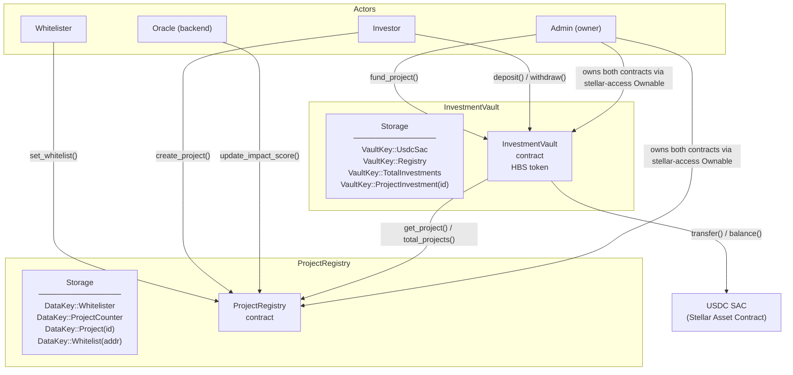

# Heliobond Contracts

On-chain core of [Heliobond](https://heliobond.io) — a green bond platform built on Stellar. Two [Soroban](https://stellar.org/soroban) smart contracts manage the full lifecycle from project registration through investor deposits and capital disbursement.

| Contract | Crate | Purpose |
|---|---|---|
| `ProjectRegistry` | `project_registry` | Stores project metadata and oracle-updated impact scores |
| `InvestmentVault` | `investment_vault` | SEP-41 token vault; accepts USDC and mints HBS shares |

---

## Architecture



**Data flow summary**

1. The Whitelister approves project creator addresses via `set_whitelist`.
2. A whitelisted creator calls `create_project`, which records metadata in `ProjectRegistry` and returns a sequential `project_id`.
3. The Oracle (off-chain backend) calls `update_impact_score` to set `credit_quality` and `green_impact` (both 0–100) for each project.
4. Investors call `deposit` on `InvestmentVault`, which pulls USDC and mints HBS shares proportional to vault NAV.
5. The Admin calls `fund_project`, which cross-calls `ProjectRegistry` to fetch the project owner address and then transfers USDC from the vault to that owner.
6. Investors call `withdraw` to burn HBS shares and redeem liquid USDC.

---

## Contract Reference

### ProjectRegistry

**Constructor**

```
__constructor(admin: Address, whitelister: Address)
```

Sets the `Ownable` owner to `admin` and records the `whitelister` address.

**Public functions**

| Function | Auth required | Description |
|---|---|---|
| `set_whitelist(account, status)` | `Whitelister` | Grant or revoke whitelist status for a creator address |
| `create_project(creator, uri)` | `creator` | Register a new project; panics if caller not whitelisted; returns `project_id` (u32, auto-incremented) |
| `get_project(id)` | none | Return `ProjectData` for a given `project_id`; panics if not found |
| `total_projects()` | none | Return the current project counter |
| `update_impact_score(project_id, credit_quality, green_impact)` | `Admin` (`#[only_owner]`) | Set impact scores (0–100 each) for a project |
| `get_all_projects()` | none | Return `Vec<(u32, ProjectData)>` of all registered projects |
| `transfer_ownership(new_owner)` | `Admin` | Transfer contract ownership (via `stellar-access Ownable`) |

**ProjectData struct**

```rust
pub struct ProjectData {
    pub owner: Address,     // project creator
    pub uri: String,        // off-chain metadata URI
    pub credit_quality: u32, // 0–100 set by oracle
    pub green_impact: u32,   // 0–100 set by oracle
}
```

---

### InvestmentVault

**Constructor**

```
__constructor(admin: Address, usdc_sac: Address, registry: Address)
```

Sets the `Ownable` owner to `admin`, stores USDC SAC and Registry addresses, initialises `TotalInvestments` to 0, and sets the SEP-41 token metadata (symbol: `HBS`, name: `Heliobond Shares`, decimals: 7).

**Public functions**

| Function | Auth required | Description |
|---|---|---|
| `deposit(from, usdc_amount)` | `from` | Transfer USDC from investor into vault; mint HBS shares; return shares minted |
| `withdraw(from, shares_amount)` | `from` (via `Base::burn`) | Burn HBS shares; transfer proportional liquid USDC back to investor; return USDC returned |
| `fund_project(project_id, amount)` | `Admin` (`#[only_owner]`) | Cross-call Registry to resolve project owner; transfer USDC from vault to owner; record investment |
| `total_assets()` | none | Return `liquid_USDC + total_investments + expected_returns` |
| `convert_to_shares(usdc_amount)` | none | Preview how many HBS a given USDC deposit would mint |
| `convert_to_assets(shares_amount)` | none | Preview how much USDC a given HBS redemption would return |
| `get_expected_returns()` | none | Iterate funded projects; sum `investment * (credit_quality + green_impact) / 200` |
| `transfer_ownership(new_owner)` | `Admin` | Transfer contract ownership |

In addition to HBS management, the vault exposes a **bridge-compatible token interface** and **Wormhole cross-chain integration** for bridging HBS to other networks (see [Bridge Security](BRIDGE_SECURITY.md)).

### Bridge Token Interface (burn/mint pattern)

| Function | Auth required | Description |
|---|---|---|
| `set_bridge(bridge)` | `Admin` (`#[only_owner]`) | Designate a bridge contract (e.g., Wormhole) authorised to mint HBS |
| `bridge_mint(to, amount)` | `bridge` | Mint HBS tokens to a recipient on inbound bridge transfer |
| `bridge_burn(from, amount)` | `from` | Burn HBS tokens for outbound bridge transfer |

This is a generic bridge interface. The bridge contract address is stored as `VaultKey::Bridge` and can be any bridge implementation (Wormhole, custom, etc.).

### Wormhole Integration

The vault implements a full Wormhole cross-chain bridge using a burn/mint pattern:

| Function | Auth required | Description |
|---|---|---|
| `set_wormhole_core(core)` | `Admin` (`#[only_owner]`) | Set the Wormhole core contract address on Stellar |
| `set_trusted_emitter(chain_id, address, trusted)` | `Admin` (`#[only_owner]`) | Authorise an emitter contract on another chain to mint HBS |
| `initiate_bridge_transfer(from, amount, target_chain, recipient, nonce)` | `from` | Burn HBS on Stellar, emit a Wormhole message for cross-chain relay |
| `complete_bridge_transfer(vaa)` | none (VAA auth) | Verify a Wormhole VAA and mint HBS to the recipient |

**Flow:**
1. User calls `initiate_bridge_transfer` → HBS burned, Wormhole message emitted.
2. Wormhole guardians observe the message and produce a signed VAA.
3. Relayer submits the VAA to `complete_bridge_transfer` on the destination chain.
4. VAA is verified via the Wormhole core contract, emitter is checked against `TrustedEmitter`, replay protection via SHA-256 digest, HBS minted to recipient.

**Architecture notes:**
- The Wormhole core contract interface is defined as a `#[contractclient]` trait. When the Wormhole core contract is deployed on Stellar, replace with `contractimport!`.
- Chain IDs use the [Wormhole chain ID registry](https://wormhole.com/docs/products/reference/chain-ids/). Stellar's proposed ID is `38`.
- VAA replay protection uses SHA-256 digest storage (`BridgeDataKey::ConsumedVaa`).
- Payload format: `HBS\0` (4-byte prefix) + `token_address` (32B) + `recipient` (32B) + `amount` (16B) + `source_chain` (4B) + `target_chain` (4B) + `nonce` (8B).

---

## Share Pricing

The vault uses a proportional NAV model identical to ERC-4626.

**First deposit (no shares in existence)**

```
shares_minted = usdc_deposited        (1 : 1)
```

**Subsequent deposits**

```
shares_minted = usdc_deposited × total_supply / total_assets
```

**Redemption**

```
usdc_returned = shares_burned × total_assets / total_supply
```

`total_assets` = liquid USDC held by the vault + `TotalInvestments` + expected yield.  
Expected yield per project = `investment × (credit_quality + green_impact) / 200`, where both scores are in [0, 100].

Redemption is limited to the vault's liquid USDC balance; funds disbursed to project owners via `fund_project` are not available for immediate withdrawal.

---

## Build & Test

**Prerequisites:** [Stellar CLI](https://developers.stellar.org/docs/tools/stellar-cli) and a Rust toolchain with the `wasm32v1-none` target.

```bash
# Add the wasm target if not already present
rustup target add wasm32v1-none

# Build both contracts
make build
# Equivalent: stellar contract build
# Output: target/wasm32v1-none/release/project_registry.wasm
#         target/wasm32v1-none/release/investment_vault.wasm

# Run all 15 tests
make test
# Equivalent: cargo test
```

---

## Deploy to Testnet

The two contracts must be deployed in order because `InvestmentVault` takes the registry contract ID as a constructor argument.

```bash
export STELLAR_SECRET_KEY=S...       # deployer secret key
export ADMIN_ADDRESS=G...            # admin/owner address
export WHITELISTER_ADDRESS=G...      # whitelister address
export USDC_SAC_ADDRESS=G...         # USDC Stellar Asset Contract on testnet

# 1. Deploy ProjectRegistry
REGISTRY_ID=$(stellar contract deploy \
  --wasm target/wasm32v1-none/release/project_registry.wasm \
  --source "$STELLAR_SECRET_KEY" \
  --network testnet \
  -- \
  --admin "$ADMIN_ADDRESS" \
  --whitelister "$WHITELISTER_ADDRESS")

echo "Registry: $REGISTRY_ID"

# 2. Deploy InvestmentVault (references the registry deployed above)
VAULT_ID=$(stellar contract deploy \
  --wasm target/wasm32v1-none/release/investment_vault.wasm \
  --source "$STELLAR_SECRET_KEY" \
  --network testnet \
  -- \
  --admin "$ADMIN_ADDRESS" \
  --usdc_sac "$USDC_SAC_ADDRESS" \
  --registry "$REGISTRY_ID")

echo "Vault: $VAULT_ID"
```

The `Makefile` target `make deploy-testnet` runs the same two steps using the environment variables `STELLAR_SECRET_KEY`, `ADMIN_ADDRESS`, `WHITELISTER_ADDRESS`, `USDC_SAC_ADDRESS`, and `REGISTRY_CONTRACT_ID`.

---

## Tech Stack

| Component | Version |
|---|---|
| Language | Rust (edition 2021, `#![no_std]`) |
| Soroban SDK | `soroban-sdk = 26.1.0` |
| OZ stellar-tokens | `stellar-tokens = 0.7.2` |
| OZ stellar-access | `stellar-access = 0.7.2` |
| OZ stellar-macros | `stellar-macros = 0.7.2` |
| Compile target | `wasm32v1-none` |
| Release profile | LTO, `opt-level = "z"`, `panic = "abort"` |
