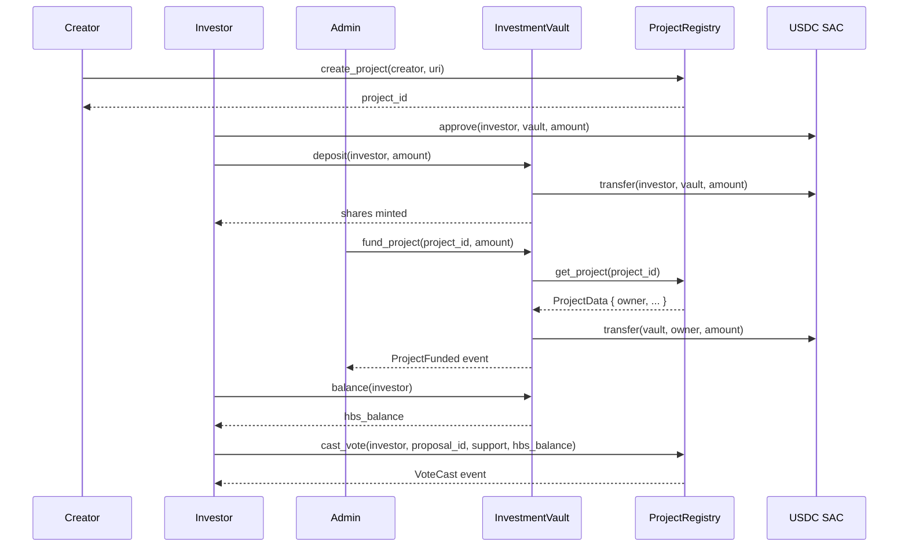

# Integration Guide

**Issue:** [#98](https://github.com/Heliobond/contracts/issues/98)

This guide covers integrating with the Heliobond smart contracts from a JavaScript/TypeScript frontend or Node.js backend using the [Stellar SDK](https://stellar.github.io/js-stellar-sdk/).

---

## Prerequisites

```bash
npm install @stellar/stellar-sdk
```

You also need:
- A funded Stellar account (testnet faucet: [friendbot](https://friendbot.stellar.org))
- The deployed contract IDs (see deployment summary in CI or ask the team)

---

## Typed SDK (`@heliobond/contracts-sdk`)

**Issue:** [#624](https://github.com/Heliobond/contracts/issues/624)

Each release tag (`v*`) publishes `@heliobond/contracts-sdk` to GitHub Packages
(`.github/workflows/sdk.yml`). It contains:

- `ProjectRegistry` / `InvestmentVault` — typed clients generated with
  `stellar contract bindings typescript` from that release's WASMs, so method
  names, argument types and return types always match the deployed ABI;
- `networks` — per-network `networkPassphrase`, `rpcUrl` and contract IDs,
  generated from `deploy/*.json`;
- `requireContractIds(name)` — returns a network's config, or throws if its
  contracts aren't deployed yet.

Prefer the SDK over hand-written `nativeToScVal` calls (the examples further
down). Hand-encoded arguments drift silently when the ABI changes.

```bash
# .npmrc
@heliobond:registry=https://npm.pkg.github.com
```

```bash
npm install @heliobond/contracts-sdk @stellar/stellar-sdk
```

```typescript
import { Keypair } from "@stellar/stellar-sdk";
import { basicNodeSigner } from "@stellar/stellar-sdk/contract";
import { InvestmentVault, requireContractIds } from "@heliobond/contracts-sdk";

const net = requireContractIds("testnet");
const keypair = Keypair.fromSecret(process.env.SECRET_KEY!);
const vault = new InvestmentVault.Client({
  contractId: net.investmentVault,
  networkPassphrase: net.networkPassphrase,
  rpcUrl: net.rpcUrl,
  publicKey: keypair.publicKey(),
  ...basicNodeSigner(keypair, net.networkPassphrase),
});

const tx = await vault.deposit({ from: keypair.publicKey(), usdc_amount: 1_000_000_000n });
const { result: sharesMinted } = await tx.signAndSend();
```

A runnable version lives at `sdk/examples/deposit.ts`
(`SECRET_KEY=S... npm run example:deposit` from `sdk/`).

**Building locally:**

```bash
stellar contract build
scripts/build_sdk.sh 0.0.0-dev   # bindings + networks.ts (gitignored)
cd sdk && npm install && npm run build
```

> The frontend and backend will adopt the SDK in follow-up PRs, replacing their
> hand-written calls and `src/lib/registry.ts`'s ScVal encoding.

---

## Contract addresses

| Contract | Testnet ID | Description |
|----------|-----------|-------------|
| `ProjectRegistry` | `CXXX…` | Manages projects, whitelist, governance |
| `InvestmentVault` | `CYYY…` | Manages deposits, shares, yield, insurance |
| USDC SAC | `CZZZ…` | USDC Stellar Asset Contract on testnet |

> Replace `CX…`, `CY…`, `CZ…` with the actual IDs from the latest deployment.

---

## Call flow: InvestmentVault <-> ProjectRegistry

`InvestmentVault` never duplicates project data — it cross-calls `ProjectRegistry` at the moments it needs project state, and vice versa is not needed since `ProjectRegistry` has no dependency on the vault. The two flows below cover the full lifecycle: registering/funding a project, and an investor depositing and having a vote counted.



Notes:
- `fund_project` is the only call where the vault reads from the registry (`get_project`) — this is how it resolves the payout address without storing project ownership itself.
- `cast_vote`'s weight is supplied by the caller, not fetched on-chain — see the [governance doc](./GOVERNANCE.md#on-chain-proposal--voting-mechanism) for why, and what to verify off-chain before trusting a vote.

---

## Connecting to the network

```typescript
import {
  SorobanRpc,
  TransactionBuilder,
  Networks,
  Keypair,
  Contract,
  nativeToScVal,
  scValToNative,
  xdr,
} from "@stellar/stellar-sdk";

const RPC_URL = "https://soroban-testnet.stellar.org";
const server   = new SorobanRpc.Server(RPC_URL);
const network  = Networks.TESTNET;

const keypair  = Keypair.fromSecret("SXXX…your secret key…");
const account  = await server.getAccount(keypair.publicKey());
```

---

## Helper: build, simulate, sign, submit

```typescript
async function invokeContract(
  contractId: string,
  method: string,
  args: xdr.ScVal[],
  keypair: Keypair,
): Promise<xdr.ScVal> {
  const contract = new Contract(contractId);
  const account  = await server.getAccount(keypair.publicKey());

  const tx = new TransactionBuilder(account, {
    fee: "100000",
    networkPassphrase: network,
  })
    .addOperation(contract.call(method, ...args))
    .setTimeout(30)
    .build();

  // Simulate to get resource fees and footprint
  const sim = await server.simulateTransaction(tx);
  if (SorobanRpc.Api.isSimulationError(sim)) {
    throw new Error(`Simulation failed: ${sim.error}`);
  }

  const prepared = SorobanRpc.assembleTransaction(tx, sim).build();
  prepared.sign(keypair);

  const result = await server.sendTransaction(prepared);
  if (result.status === "ERROR") {
    throw new Error(`Submit failed: ${JSON.stringify(result.errorResult)}`);
  }

  // Poll for confirmation
  let response = await server.getTransaction(result.hash);
  while (response.status === "NOT_FOUND") {
    await new Promise(r => setTimeout(r, 1000));
    response = await server.getTransaction(result.hash);
  }
  if (response.status !== "SUCCESS") {
    throw new Error(`Transaction failed: ${response.status}`);
  }
  return response.returnValue!;
}
```

---

## ProjectRegistry — key operations

### Check if an address is whitelisted

> **Note:** There is no on-chain `get_whitelist` getter. The only way to
> determine current whitelist status off-chain is to index `WhitelistSet`
> events emitted by `set_whitelist`. The example below filters the event
> stream for the most recent status for a given address.

```typescript
const REGISTRY = "CXXX…";

// Index WhitelistSet events to reconstruct current whitelist status.
// There is no direct on-chain query for this — set_whitelist emits
// WhitelistSet { account, status } and that is the only source of truth.
const events = await server.getEvents({
  filters: [{ type: "contract", contractId: REGISTRY }],
  startLedger: 0,
  limit: 100,
});
const target = keypair.publicKey();
let isWhitelisted = false;
for (const event of events.events) {
  if (event.type !== "contract") continue;
  const topics = event.topics.map(scValToNative);
  if (topics[0] !== "WhitelistSet") continue;
  if (topics[1] === target) {
    isWhitelisted = topics[2] as boolean;
  }
}
```

### Create a project

```typescript
const projectId = scValToNative(await invokeContract(
  REGISTRY,
  "create_project",
  [
    nativeToScVal(keypair.publicKey(), { type: "address" }),  // creator
    nativeToScVal("ipfs://QmYourHash",  { type: "string" }),  // uri
    nativeToScVal(0n,                   { type: "u64" }),     // maturity_date (0 = open-ended)
    nativeToScVal(hash("project-metadata-v1"), { type: "bytesN<32>" }), // metadata_hash
  ],
  keypair,
));
console.log("Project created with ID:", projectId);
```

### Create a governance proposal

```typescript
const proposalId = scValToNative(await invokeContract(
  REGISTRY,
  "create_proposal",
  [
    nativeToScVal(keypair.publicKey(), { type: "address" }),
    nativeToScVal("Increase insurance premium to 1%", { type: "string" }),
    nativeToScVal(BigInt(7 * 24 * 3600), { type: "u64" }), // 7-day voting period
  ],
  keypair,
));
```

### Cast a vote

Query the investor's HBS share balance first, then pass it as the weight:

```typescript
const VAULT = "CYYY…";

// Read HBS balance (view — no auth, no fee beyond simulation)
const balanceSim = await server.simulateTransaction(
  new TransactionBuilder(account, { fee: "100", networkPassphrase: network })
    .addOperation(new Contract(VAULT).call(
      "balance",
      nativeToScVal(keypair.publicKey(), { type: "address" }),
    ))
    .setTimeout(30)
    .build()
);
const hbsBalance: bigint = scValToNative((balanceSim as any).result.retval);

await invokeContract(
  REGISTRY,
  "cast_vote",
  [
    nativeToScVal(keypair.publicKey(), { type: "address" }),
    nativeToScVal(proposalId,  { type: "u32" }),
    nativeToScVal(true,        { type: "bool" }),  // support = true
    nativeToScVal(hbsBalance,  { type: "i128" }),
  ],
  keypair,
);
```

---

## InvestmentVault — key operations

### Approve USDC and deposit

Soroban SAC tokens use SEP-41. Approve the vault to spend your USDC first:

```typescript
const USDC_SAC = "CZZZ…";
const DEPOSIT_AMOUNT = 1_000_000_000n; // 100 USDC (7 decimals)

// Step 1: approve
await invokeContract(
  USDC_SAC,
  "approve",
  [
    nativeToScVal(keypair.publicKey(), { type: "address" }), // from
    nativeToScVal(VAULT,              { type: "address" }), // spender
    nativeToScVal(DEPOSIT_AMOUNT,     { type: "i128" }),
    nativeToScVal(99999999n,          { type: "u32" }),     // expiration_ledger
  ],
  keypair,
);

// Step 2: deposit
const sharesMinted = scValToNative(await invokeContract(
  VAULT,
  "deposit",
  [
    nativeToScVal(keypair.publicKey(), { type: "address" }),
    nativeToScVal(DEPOSIT_AMOUNT,      { type: "i128" }),
  ],
  keypair,
));
console.log("Shares minted:", sharesMinted.toString());
```

### Read portfolio (view — free)

```typescript
const portfolioSim = await server.simulateTransaction(
  new TransactionBuilder(account, { fee: "100", networkPassphrase: network })
    .addOperation(new Contract(VAULT).call(
      "get_portfolio",
      nativeToScVal(keypair.publicKey(), { type: "address" }),
    ))
    .setTimeout(30)
    .build()
);
const portfolio = scValToNative((portfolioSim as any).result.retval);
console.log("Portfolio:", portfolio);
// {
//   shares: bigint,
//   usdc_value: bigint,
//   claimable_yield: bigint,
//   share_of_pool_bps: bigint,
//   total_deposited: bigint,
// }
```

### Claim yield

```typescript
const claimed = scValToNative(await invokeContract(
  VAULT,
  "claim_yield",
  [nativeToScVal(keypair.publicKey(), { type: "address" })],
  keypair,
));
console.log("Yield claimed (USDC stroops):", claimed.toString());
```

### Withdraw shares

```typescript
const usdcReturned = scValToNative(await invokeContract(
  VAULT,
  "withdraw",
  [
    nativeToScVal(keypair.publicKey(), { type: "address" }),
    nativeToScVal(sharesMinted / 2n,  { type: "i128" }),  // redeem half
  ],
  keypair,
));
```

---

## Error handling

All contract panics surface as Soroban `HostError` codes in the simulation or transaction result. Common patterns:

| Panic message | Cause | Resolution |
|---------------|-------|------------|
| `"not whitelisted"` | Creator not in whitelist | Ask admin to call `set_whitelist` |
| `"deposit must be positive"` | Amount ≤ 0 | Validate input before submitting |
| `"deposit exceeds maximum"` | Amount > 1 billion USDC | Split into multiple deposits |
| `"uri too short"` | URI < 8 bytes | Provide a valid IPFS or HTTPS URI |
| `"insufficient deployable USDC"` | Vault liquid balance minus insurance reserve < amount | Wait for more deposits or reduce amount |
| `"already voted"` | Voter already cast a vote on this proposal | UI should check `has_voted` before showing vote button |
| `"voting period too short"` | Duration < 86 400 s | Use at least 1 day |
| `"insurance already claimed"` | Payout already made for this project | Check `InsuranceClaimed` state first |

```typescript
try {
  await invokeContract(VAULT, "deposit", [...], keypair);
} catch (err: any) {
  if (err.message.includes("deposit exceeds maximum")) {
    console.error("Deposit too large — split into multiple transactions");
  } else {
    throw err;
  }
}
```

---

## Events

Listen to contract events using the Stellar Horizon API or an indexer:

```typescript
// Via Horizon (events endpoint)
const resp = await fetch(
  `https://horizon-testnet.stellar.org/contracts/${VAULT}/events?limit=20`
);
const { _embedded: { records } } = await resp.json();
records.forEach((ev: any) => {
  console.log(ev.type, ev.value);
});
```

Key event topics by contract:

| Contract | Topic | Fired when |
|----------|-------|-----------|
| `InvestmentVault` | `deposit` | Investor deposits USDC |
| `InvestmentVault` | `withdraw` | Investor withdraws |
| `InvestmentVault` | `yield_received` | Owner posts yield |
| `InvestmentVault` | `yield_claimed` | Investor claims yield |
| `InvestmentVault` | `insurance_claimed` | Default payout made |
| `ProjectRegistry` | `project_created` | New project registered |
| `ProjectRegistry` | `project_updated` | Impact scores updated |
| `ProjectRegistry` | `score_changed` | Score changed (includes old + new values) |
| `ProjectRegistry` | `project_certified` | Certification status changed |
| `ProjectRegistry` | `proposal_created` | Governance proposal opened |
| `ProjectRegistry` | `vote_cast` | Vote recorded |
| `ProjectRegistry` | `proposal_executed` | Proposal finalised |
